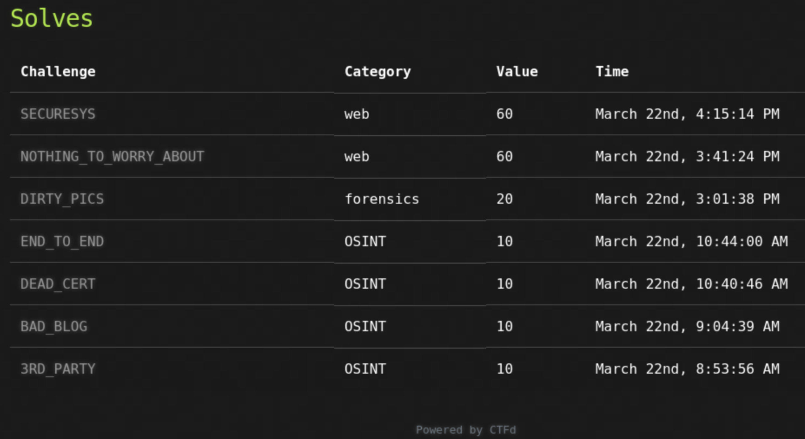

# CrikeyConf X 
## CTF
It was difficult to balance listening to talks when there were CTF challenges to crack. 

<figure>
    <kbd></kbd>
</figure>

I went down the correct path on NOTHING_TO_WORRY_ABOUT but wasted a bunch of time after a making a syntax error in a JWT. If I'd not made that error I would have solved in 1/3 the time it ended up taking, but wouldn't have met @fieldse and worked with him to solve NOTHING_TO_WORRY_ABOUT and SECURESYS. Oh, the name of the forensics challenge was misleading.